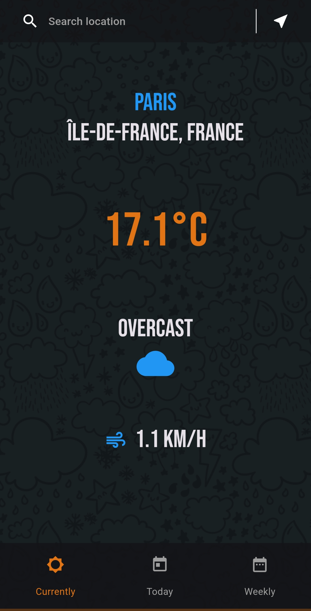
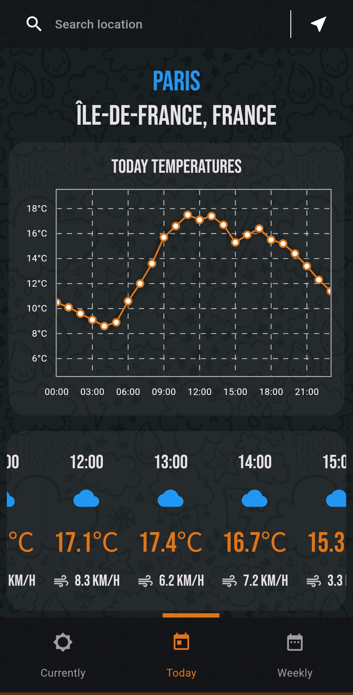
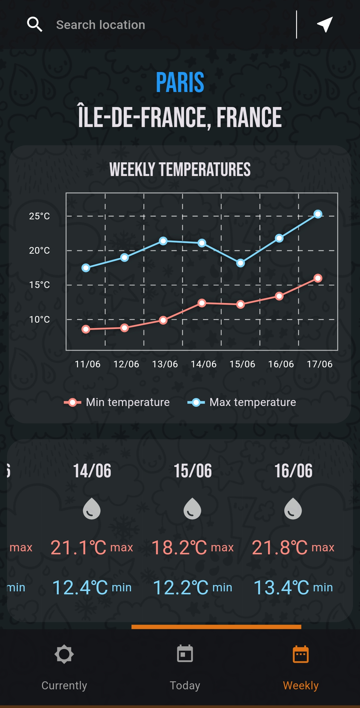

### Projet

Applacation météo en flutter

|  |  |  |
|:------------------------------------------:|:------------------------------------------:|:------------------------------------------:|
| Affichage de la météo actuelle           | Affichage de la météo de la journée           | Affichage de la météo sur la semaine           |

### Fonctionnalités

- Géolocalisation
- Affichage de la météo actuelle
- Affichage de la météo de la journée
- Affichage de la météo sur 7 jours

### Technologies

- Flutter

#### Accessible&nbsp;[ici](https://github.com/lucaslion/weatherapp)

